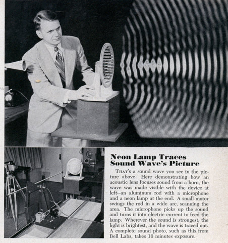

Разработка интерактивных систем на OpenFrameworks
-------------------------------------------------
_04._ Интерактивный звук
------------------------

Что такое цифровой звук, и звук вообще?



Звук, <i>в широком смысле</i> — упругие волны, продольно распространяющиеся в среде и создающие в ней механические колебания; <i>в узком смысле</i> — субъективное восприятие этих колебаний специальными органами чувств животных или человека. Как и любая волна, звук характеризуется амплитудой и частотой.

### Представление звука в цифровом виде
Реальный звук захватывается микрофоном, затем подвергается аналого-цифровому преобразованию.

Оно характеризуется
* разрешением по времени - **частота дискретизации**, _[процедура - дискретизация]_
* разрешением по амплитуде - **разрядность**. _[процедура - квантование]_


#### Частота дискретизации
* 8 000 Гц — телефон, достаточно для речи.
* 11 025 Гц — игры, сэмплы для электронной музыки.
* <b>22 050</b> Гц — то же, что и 11 025 Гц.
* <b>44 100</b> Гц — многие синтезаторы и библиотеки сэмплов. Audio CD.
* 48 000 Гц — студии звукозаписи, живые инструменты, вокал. DVD.
* 96 000 Гц — DVD-Audio (MLP 5.1).
* 192 000 Гц — DVD-Audio (MLP 2.0).

#### Разрядность
Разрядность - число бит, используемых для представления отсчетов сигнала при квантовании (в нашем случае - при квантовании амплитуды).

* 8 бит сэмплы электронной музыки.
* 12 бит студийные звуковые эффекты.
* <b>16</b> бит компьютерные игры, плееры, сэмплы, Audio CD.
* 18 бит студийные звуковые эффекты
* 24 бит живые звуки, вокал, DVD-Audio
* <b>32</b> бит представление с плавающей точкой, поэтому точность не теряется для тихих звуков, поэтому используется для внутренней обработки звука.
* 64 бит также с плавающей точкой, обработка звука.


#### Представление звука в памяти
Пример:

1 секунду 16-битного звука с частотой дискретизации 44100 Гц можно представить в виде вектора
 X = ( x _1, x _2 , ..., ..., x _44100), где 0 <= x  _i <= 2^16-1 = 65535.
 
Представление звуков таких способом - с помощью вектора - называется **PCM** (Pulse Code Modulation).
Оно является наиболее распространенным и аналогично пиксельному представлению изображений.

#### Фундаментальное различие звука и изображений
С изображениями очень удобно работать на уровне пикселов. В частности:
1. два изображения мы считаем одинаковыми, если значения их пикселов близки.
2. можно изменять изображения, основываясь назначениях соседних пикселов (например, операция сглаживания).

Для звука в PCM формате обе возможности **неприменимы**, покажем это на примере:


Последние два звука звучат одинаково. А их функции амплитуды - существенно различные. Таким образом, человеческое ухо воспринимает спектр звука, то есть состав его частот, а не амплитудное представление звука.

#### Что легко/трудно делать "прямо" со звуком в формате PCM

**Легко**:
Изменение и перестановка отдельных отсчетов, без учета соседей
- переставлять кусочки,
- менять громкость кусочков,
- делать реверс - переворот звука от конца к началу,
- смешивать несколько звуков,
- смешивать и менять стерео-каналы,
- делать простейшую компрессию,
- добавлять простейшее эхо.

_Сэмплеры, портастудии и студийные программы делают это виртуозно._

**Трудно**:
Учет соседних отсчетов
- сравнивать два звука на похожесть,
- подавлять низкие или высокие частоты,
- добавлять реверберацию.

_Это обычно делается не прямо в PCM, а через спектральное представление звука (оконное преобразование Фурье)._

### Форматы хранения звука
* **WAV** - wav = заголовок + байты PCM Хранит звук без потери качества
_(аналог в изображениях - bmp)_
* **MP3** - Данные с потерями, хорошо подходит для хранения музыки
_(аналог в изображениях - jpg)_
* **AMR** - Данные с потерями, предназначен для хранения речи. Используется в мобильной телефонии (2011).
_(аналог в изображениях - png)_

### Способы генерации цифрового звука
Есть следующие способы построения PCM-представления некоторого звука или музыки:
1. Сэмплирование - Используется для производства всей музыки. Устройства - сэмплеры
2. (Субтрактивный) Синтез - Используется преимущественно для современной электронной музыки. Устройства - синтезаторы.
3. FM-синтез
4. Аддитивный синтез
5. Гранулярный синтез
6. S&S - Sample & Synthesis - сэмплирование, анализ, последующий синтез - сегодня одна из наиболее лучших технологий воспроизведения"живых" инструментов.


Рассмотри три способа генерации звука: сэмплирование, субтрактивный и аддитивный синтез.

#### Сэмплирование
Запись: "Живой звук" - микрофон - АЦП - PCM-формат.

Воспроизведение: PCM-формат - ЦАП - динамик.

_Дополнительные возможности: можно менять скорость воспроизведения, тогда повысится тон и скорость сэмпла.
Современные алгоритмы также позволяют менять тон сэмпла без изменения его скорости, и наоборот._

Сэмплер Akai MPC1000:


#### Субтрактивный Синтез
В докомпьютерное время:
несколько простых волн (прямоугольная, синусоидальная, треугольная) обрабатывались набором фильтров (НЧ, ВЧ, вырезание нужной частоты). Полученный звук шел на динамики.

Сейчас:
делается в цифровом виде.
Есть трудности - нужно аккуратно учитывать известные проблемы, связанные с цифровым представлением звука ("алиасинг").

Синтезатор Minimoog:


#### Аддитивный синтез
Аддитивный синтез основан на построении звука с помощью суммирования множества гармоник (т.е. синусоид разной частоты) с изменяющейся громкостью.

_Любой звук можно представить с произвольной точностью как сумму большого числа гармоник с меняющейся громкостью. Но на практике работа с большим числом гармоник требует больших вычислительных ресурсов. Хотя, в настоящее время существует несколько аппаратных и программных аддитивных синтезаторов._

## Примеры проектов на базе openFrameworks
Про установку, настройку фреймворка, и IDE для сборки проектов, можно <a href="http://habrahabr.ru/post/244265/">прочитать здесь</a>.

### Воспроизведение сэмплов в openFrameworks - проект "звуковой ландшафт"
Суть проекта: пользователь тыкает мышью в разные части экрана и начинает доноситься <a href="http://www.freesound.org/samplesViewSingle.php?id=221">некоторый звук</a> 


```cpp
 //Объявление переменных
ofSoundPlayer sample;  //проигрыватель сэмпла
ofPoint p; //точка и радиус - для рисования кружка
float rad;

void testApp::setup(){
  sample.loadSound("sound.wav");  //Загрузка сэмпла из папки bin/data
  sample.setVolume(0.5f);  //громкость, [0, 1]
  sample.setMultiPlay(true);  //разрешаем запускать несколько сэмплов 
  ofSetFrameRate( 60 ); //скорость рисования кадров
  ofSetBackgroundAuto( false ); //выключаем стирание фона 
  ofBackground(255,255,255);
}

void testApp::update(){
  ofSoundUpdate();  //обновляем состояние звуковой системы
}

void testApp::draw(){
  //если звук играет, рисовать прозрачный кружок
  ofEnableAlphaBlending();
  if (sample.getIsPlaying()) {
    //случайный цвет
    ofSetColor(ofRandom(0, 255), ofRandom(0, 255), ofRandom(0, 255), 20);
    ofCircle( p.x, p.y, rad );
  }
  ofDisableAlphaBlending();
}

//нажата мышь
void testApp::mousePressed(int x, int y, int button){
  float h = ofGetHeight(); //высота экрана
  //вычисляем желаемую скорость воспроизведения сэмпла,
  //при этом 1.0 - это оригинальная скорость сэмпла
  float speed = (h - y) / h * 3.0;
  if ( speed > 0 ) {
    sample.play();  //запуск нового сэмпла 
    sample.setSpeed( speed );  //установка скорости воспроизведения 

    //запоминаем точку и радиус кружка для рисования
    p = ofPoint( x, y );
    rad = (3 - speed);
    rad = 20 * rad * rad;
  }
}
```

### Сценарий проекта"Аддитивный синтезатор"
Суть проекта: пользователь на белом фоне машет руками перед камерой. Имеется **n** гармоник. Экран разделен на **n**
вертикальных полосок, в каждой считается число пикселов, яркость которых меньше некоторого порога. Это число определяет громкость соответствующих гармоник.

Используем **n = 20** синусоидальных гармоник, с частотами
* 100 Гц,
* 200 Гц,
* ...
* 2000 Гц 

Гармоники играются с помощью зацикленных сэмплов, у которых просто меняется громкость.

Исходный код проекта:

```cpp
//Объявляем переменные

//видео-граббер для "захвата" видеокадров
ofVideoGrabber grabber;
int w;  //ширина кадра
int h;  //высота кадра 

const int n = 20;  //число гармоник 
ofSoundPlayer sample[ n ];  //сэмплы гармоник 
float volume[ n ];  //громкость гармоник 
int N[ n ];  //число пикселов, играющих в этой гармонике

ofSoundPlayer sampleLoop;  //сэмпл барабанной петли

//Инициализация
void testApp::setup(){

  w = 320;
  h = 240;
  grabber.initGrabber(w, h); //подключение камеры
  
  //загрузка сэмплов гармоник
  for (int i=0; i<n; i++) {
    int freq = (i+1) * 100;
    sample[ i ].loadSound( ofToString(freq) + ".wav");  //файлы называются 100.wav,...
    sample[ i ].setVolume(0.0);  //громкость 
    sample[ i ].setLoop(true);  //зацикливаем звук 
    sample[ i ].play();  //запуск звука
  }
}

//Обновление состояния
void testApp::update(){
  grabber.grabFrame(); //захват кадра
  if (grabber.isFrameNew()){ //если пришел новый кадр
    for (int i=0; i<n; i++) { volume[i] = 0; N[i] = 0; }  //сбрасываем гармоникиun
    signed char * input = grabber.getPixels(); //пикселы входного изображения
    for (int y=0; y<h; y++) {for (int x=0; x<w; x++) {
      //входной пиксел (x, y):
      int r = input[ 3 * (x + w * y) + 0 ];
      int g = input[ 3 * (x + w * y) + 1 ];
      int b = input[ 3 * (x + w * y) + 2 ];
      int result = (r + g + b > 400 ) ? 0 : 1;  //пороговая обработка
      int i = (x * n / w);//в какую гармонику писать результат
      volume[ i ] += result;
      N[ i ]++;
    }
  }  //устанавливаем новые громкости гармоник
  for (int i=0; i<n; i++) {
    if ( N[ i ] > 0 ) { volume[ i ] /= N[ i ]; }  //нормируем громкости в [0, 1]
      sample[ i ].setVolume( volume[ i ] / n );  //громкость.
      //Делим на n, иначе будет искажение выходного звука
    }
  }
  ofSoundUpdate();//обновляем состояние звуковой системы}

//Рисование
void testApp::draw() {
  ofBackground(255,255,255);  //задаем цвет фона
  float w = ofGetWidth();  //высота и ширина экрана
  float h = ofGetHeight();
  ofSetColor( 255, 255, 255 );  //иначе картинка кадра нарисуется неверно
  grabber.draw(0, 0, w, h);  //вывод кадра 

  //рисование гармоник 
  ofEnableAlphaBlending(); //включение прозрачности
  ofSetColor( 0, 0, 255, 80 );  //синий цвет с непрозрачностью 80
  for (int i=0; i<n; i++) {
    float harmH = volume[i] * h;//высота столбика гармоники i 
    ofRect( i * w / n, h - harmH, w / n, harmH );
  }
  ofDisableAlphaBlending();  //выключение прозрачности
}
```

Вот что получилось:
http://www.youtube.com/watch?v=y70Oxk1RAOM
