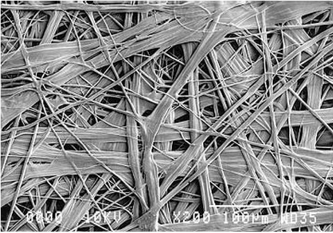

Разработка интерактивных систем на OpenFrameworks
=================================================

Введение в компьютерное зрение
------------------------------

Получение и обработка изображений с камеры
УрГУ / ИММ весна 2011
лекции и объявления:
www.uralvision.blogspot.com

вопросы по проектам и программированию: perevalovds@gmail.com

Что такое компьютерное зрение

Определение
(из Википедии)

Компьютерное зрение — теория и технология создания машин, которые могут видеть. 


Определение

Подразделы компьютерного зрения включают 
- воспроизведение действий, 
- обнаружение событий, 
- слежение, 
- распознавание образов, 
- восстановление изображений.

Примеры изображений
Обычный свет, радиоволны, ультразвук - все они являются источниками изображений:

1. Цветные изображения видимого спектра
2. Инфракрасные изображения
3. Ультразвуковые изображения
4. Радиолокационные снимки
5. Изображение с данными о глубине

Примеры изображений
1. Цветные изображения видимого спектра


Примеры изображений
2. Инфракрасные изображения


Примеры изображений
3. Ультразвуковые изображения 
Изображение с гидролокатора бокового обзора:

http://ess.ru/publications/2_2003/sedov/ris6.jpg

Примеры изображений
4. Радиолокационные снимки

Снимок города радаром:


Примеры изображений
5. Изображения с данными о глубине


Видео


http://www.youtube.com/watch?v=pk_cQVjqFZ4

1-й признак задач компьютерного зрения

Входные данные являются двумерным массивом данных - то есть, "изображением".


Но двумерные массивы данных используются не только в компьютерном зрении:


2-й признак задач компьютерного зрения

Цель обработки - извлечение и использование информации о цветовых и геометрических структурах на изображении.



Дисциплины, занимающиеся 2D-изображениями
1. Обработка сигналов и изображений
Низкоуровневая обработка данных, как правило, без детального изучения содержимого изображения.
Цели - восстановление, очистка от шумов, сжатие данных, улучшение характеристик (четкость, контраст, ...)

2. Компьютерное зрение
Среднеуровневый анализ данных, заключающийся в выделении на изображении каких-либо объектов, и измерении их параметров.

3. Распознавание образов
Высокоуровневый анализ данных - определение типа объекта. Входные данные, как правило, должны быть представлены в виде набора признаков. Часто для вычисления признаков применяются 1. и 2.

Камеры для компьютерного зрения
- Основные характеристики
- Примеры хороших камер

Основные характеристики
Для разных задач обработки в реальном режиме времени нужны разные видеокамеры.

Их основные характеристики:

1. Разрешающая способность

2. Число кадров в секунду

3. Тип получаемых данных

4. Способ передачи данных в компьютер

Разрешающая способность
Это размер изображения в пикселах, получаемого с камеры.


TODO

http://www.mtlru.com/images/
320 x 240
точность измерения
при наблюдении объекта размером 1м:
3.13 мм
размер 30 кадров:
6.6 Мб 

640 x 480 точность измерения
при наблюдении объекта размером 1м:
1.56 мм

размер 30 кадров:
26.4 Мб
1280 x 1024 точность измерения
при наблюдении объекта размером 1м:
0.97 мм

размер 30 кадров:
112.5 Мб

Число кадров в секунду
Это число картинок, получаемых с камеры за секунду.

30 к/сек

время между кадрами:
33 мсек

60 к/сек

время между кадрами:
16 мсек

150 к/сек

время между кадрами:
 6 мсек 

Можно использовать для музыкального инструмента
http://www.youtube.com/watch?v=7iEvQIvbn8o

Тип получаемых данных
Какие данные получаем с камеры для обработки.

Цветная или полутоновая картинка видимого спектра


Инфракрасное изображение


Используя невидимую глазу ИК-подсветку, такая камера будет видетьв темном помещении (на перфомансе)

Цветное изображение + глубина
(информация о расстоянии до объектов)

Способ передачи данных в компьютер

- Аналоговые
- Веб-камеры (USB-камеры)
- Firewire-камеры (камеры IEEE-1394)
- Сетевые (IP-камеры)
- "Умные" камеры (Smart cameras)

Аналоговые

Исторически появились первыми,
сигнал передается в аналоговом сигнале (формат ТВ).

(+) передают данные на большие расстояния, хотя и с помехами (100 м)
(+) легко монтируются, малые размеры

(-) для ввода сигнала в компьютер требуется специальная плата или "ТВ-тюнер", они обычно потребляют много вычислительных ресурсов.
(-) "интерлейс", или черезстрочная развертка - очень затрудняет анализ изображения, если есть движение.
(фактически идет 2 полукадра, каждый 50 раз/сек)

Веб-камеры (USB-камеры)


Появились в ~2000г.,
передают данные через USB-протокол,
в несжатом виде, либо сжатом в JPEG.

(+) легко подключаются к компьютеру и программному обеспечению
(+) дешевые, имеются в продаже

(-) Накладные расходы - для раскодирования JPEG требуются вычислительные ресурсы.
(-) В дешевых моделях обычно плохая оптика и матрица (дает шум на изображении)
(-) Из-за ограничений пропускной способности USB нельзя подключить более 2-х камер к одному USB-хабу, но обычно на PC 2-3 USB хаба.

Firewire-камеры (IEEE-1394)

Камеры, передающие сигнал по протоколу FireWire,
обычно в пылевлагозащитном корпусе, обычно это камеры для промышленного применения.

(+) передают несжатое видео в отличном качестве на большой скорости
(+) можно подключать несколько камер 
(+) обычно имеют отличную оптику

(-) высокая цена
(-) требуют питания, что иногда осложняет подключение к портативным компьютерам

Сетевые (IP-камеры)

Камеры, передающие данные по
сетевому (проводному или беспроводному)
каналу. Сейчас стремительно набирают
популярность во всех сферах.

(+) простое подключение к компьютеру
(+) удобство монтажа
(+) возможность передачи данных на неограниченное расстояние, что позволяет конструировать сеть камер, охватывающих здание или район, крепить на дирижабль и т.п.
(+) возможность управления - вращать камеру, настраивать увеличение

(-) могут быть проблемы со скоростью отклика
(-) пока относительно высокая цена
(-) пока недостаточно портативны (2011 год)


"Умные" камеры (Smart cameras)
Камеры, в корпусе которых
располагается компьютер.
Такие камеры являются полнофункциональными
системами технического зрения,
передающие выходные данные об обнаруженных
объектах и т.п. по различным протоколам.

(+) компактность.
(+) масштабируемость - легко строить сети из таких камер.

(-) часто для них требуется адаптация существующих проектов.
(-) дешевые модели достаточно медленные, поэтому хорошо справляются лишь с относительно простыми задачами анализа изображений.


Отдельный тип: Инфракрасные камеры

Конструируется из обычной камеры
путем добавления ИК-фильтра
и, зачастую, ИК-подсветки.

+ ИК-лучи почти не видны человеку (в темноте видно как слабый красный цвет), поэтому часто используют для упрощения анализа объектов в поле зрения.

- специализированные ИК-камеры, подходящие для технического зрения, не являются массовым товаром, поэтому их обычно нужно заказывать.

Примеры хороших камер
Sony PS3 Eye

320 x 240 : 150 FPS
640 x 480 : 60 FPS

Типы данных:
видимый свет,
ИК (требуется удаление ИК-фильтра)

Цена: 50$.

USB, CCD


Примеры хороших камер
Point Grey Flea3 
648 x 488 : 120 FPS

Тип данных:
- видимый свет,
- ИК (?) 

Цена: 600$.

Модель FL3-FW-03S1C-C 
IEEE 1394b, CCD 

Примеры хороших камер
Microsoft Kinect 
640 x 480 : 30 FPS

Тип данных:
видимый свет + глубина

Цена: 150$.

(глубина - стереозрение с помощью лазерной ИК-подсветки,
поэтому не работает при солнечном свете)
USB, CMOS 

Примеры хороших камер
Point Grey BumbleBee2
640 x 480 : 48 FPS

Тип данных:
видимый свет + глубина

Цена: 2000$.

(Глубина - стереозрение с двух камер)
IEEE 1394b, CCD 

Что делать, если нет вебкамеры?
1. Поставить программу SplitCam
http://www.splitcamera.com/
Она позволяет эмулировать вебкамеру, задавая в качестве входа произвольный видеофайл (обычно avi).

2. Найти видеофайл формата avi, и загрузить его воспроизвести в SplitCam, и затем запустить проект CameraTest, см. ниже.

Внимание Даже если SplitCam выключен, он является 0-й камерой в системе. Поэтому, если включить обычную вебкамеру, то в проект всё равно будут приходить черные кадры. Решение: выбрать камеру 1 в проекте, либо деинсталлировать SplitCam.


Получение изображения с камеры в openFrameworks
===============================================

Получение и отображение кадра в OperFrameworks - проект CameraTest

Подготовка проекта:

В папке `openFrameworks/app/examples` взять пример `emptyProject`,
скопировать его в `/app/myApps/CameraTest`

 

Проект CameraTest
-----------------

testApp.cpp:

```cpp
#include "testApp.h"
//Объявляем переменные
//видео-граббер для "захвата" видеокадров: 
ofVideoGrabber         grabber;
int                 w;                //ширина кадра
int                 h;                //высота кадра

//Инициализация
 void testApp::setup() {
    w         = 320;
    h         = 240;
    grabber.initGrabber(w, h);        //подключение камеры
    ofBackground(255,255,255);   //задаем цвет фона
}

//Обновление состояния
void testApp::update(){
    grabber.grabFrame();        //захват кадра
} 
 
//Рисование
void testApp::draw(){
    grabber.draw(0,0);            //вывод кадра
}
```


Пороговая обработка

Способ хранения изображений  в памяти 
Изображение обычно хранится в памяти путем перечисления его пикселов последовательно, строка за строкой. 
(JPEG, PNG и т.п. - это запакованные изображения, они хранятся принципиально по-другому)

В зависимости от типа изображения на один пиксел может приходиться разное число байт.
1 байт - черно-белое (монохромное),
3 байта - цветное (Red, Green, Blue),
4 байта - цветное с прозрачностью (Red, Green, Blue, Alpha).

Современные GUI используют 4-байтные изображения для картинок, иконок и т.п.
Ввод с камеры идет в 3-х байтном виде.
Анализ изображения на этапах выделания объектов часто ведется с 1-байтными изображениями.
Важно: ось координат OY и последовательность RGBA могут меняться в зависимости от формата файлов.

Способ хранения изображений 
в памяти 
Пусть
`unsigned char* image;`
- изображение с k байт на пиксел, размером w x h пикселов

Тогда доступ к компонентам пиксела (x, y):
```
image[ k * ( x + w * y ) + 0],
image[ k * ( x + w * y ) + 1],
... 
image[ k * ( x + w * y ) + k-1 ].
```
 
 
Например, для пиксела (x, y)  RGB-изображения: 
```
image[ 3*(x + w*y) + 0 ]  - Red
image[ 3*(x + w*y) + 1 ]  - Green
image[ 3*(x + w*y) + 2 ]  - Blue
``` 


Пороговая обработка
Пороговая обработка позволяет найти пикселы, яркость, т.е. `(0.2989*Red + 0.5870 * Green + 0.1140 *Blue) `
либо одна цветовая компонента (Red, Green, Blue) которых 
больше некоторого порогового значения.

Что нужно для проведения обработки:
- получить доступ к пикселам кадра для их анализа,
- проанализировать пикселы и вывести результат на экран.


Пороговая обработка

++++++++ Добавляем в "Объявление переменных":

```cpp
//обработанные байты изображения
unsigned char *     outImage;
//текстура для вывода на экран обработанного изображения 
ofTexture            outImageTexture; 
``` 
 
++++++++ Добавляем в "setup()":
 
```cpp
//выделение памяти для анализа изображения 
outImage     = new unsigned char[w * h * 3];
 
//создание текстуры для вывода результата на экран
outImageTexture.allocate( w, h, GL_RGB );

Пороговая обработка
//Обновление состояния
void testApp::update(){
        grabber.grabFrame();        //захват кадра
        if (grabber.isFrameNew()){    //если пришел новый кадр
        //пикселы входного изображения:
        unsigned char * input = grabber.getPixels(); 
        //пробегаем по ним   
        for (int y=0; y<h; y++) {
            for (int x=0; x<w; x++) {
                //входной пиксел (x, y):
                int r = input[ 3 * (x + w * y) + 0 ];
                int g = input[ 3 * (x + w * y) + 1 ];
                int b = input[ 3 * (x + w * y) + 2 ];
                //пороговая обработка по каналу Blue
               int result = ( b > 100 ) ? 255 : 0;                
                //запись в выходное изображение, будет черный или белый цвет:
                outImage[ 3 * (x + w * y) + 0 ] = result;
                outImage[ 3 * (x + w * y) + 1 ] = result;
                outImage[ 3 * (x + w * y) + 2 ] = result;   
        }    }
        //запись в текстуру для последующего вывода ее на экран
        outImageTexture.loadData(outImage, w, h, GL_RGB);       
}
```

```cpp
//Рисование
void testApp::draw(){
     grabber.draw( 0, 0 );                            //вывод кадра
     outImageTexture.draw( w, 0, w, h );     //вывод результата обработки
} 
``` 
 
 

Поиск цветовых меток
--------------------

Решим задачу поиска координат объекта синего цвета на входном кадре.

Сначала найдем синие пикселы.
Это такие пикселы, Blue-канал которых существенно больше их Red и Green-каналов. Для этого:

>>>>>>>>> Меняем строку с int result... на:
```cpp
int result = ( b > r + 100 && b > g + 100 ) ? 255 : 0;
```

Т.о. мы пометили "синие" пикселы.
Теперь найдем координаты их центра. 
Для простоты будем считать, что синий объект в кадре один. 
Тогда можно взять центр тяжести помеченных пикселов.


Поиск цветовых меток
++++++++ Добавляем в "Объявление переменных":
 
```cpp
ofPoint pos;    //координаты объекта
```

++++++++ Добавляем в "update()" - расчет центра тяжести помеченных пикселов
```cpp
        pos = ofPoint( 0, 0 );
        int n = 0;    //количество найденных пикселов
        for (int y=0; y<h; y++) {
            for (int x=0; x<w; x++) {
                int b = outImage[ 3 * (x + w * y) + 2 ]; //смотрим обработанное изображение
                if ( b == 255 ) {        //мы так ранее пометили синие точки
                    pos.x += x;  pos.y += y;
                    n++;
                }
            }
        }
        //усредняем
        if ( n > 0 ) {
            pos.x /= n;
            pos.y /= n;
        }
```

```cpp
//Рисование
void testApp::draw(){ 
    //это надо добавить - пока не могу сказать зачем - иначе текстура             неправильно рисуется:
    ofSetColor( 255, 255, 255 );        
 
    grabber.draw( 0, 0 );            //вывод кадра
    outImageTexture.draw( w, 0, w, h );     //вывод результата обработки

    //выводим кружок вокруг объекта
    ofSetColor( 0, 255, 0 );       //зеленый цвет 
    ofNoFill();                      //выключить заливку
    ofCircle( pos.x, pos.y, 20);    //нарисовать круг на исх. кадре
    ofCircle( pos.x + w, pos.y, 20);    //нарисовать круг на обраб. кадре
 
} 
```

Результат:


Эти координаты можно использовать для управления чем-то. 

Кстати, "n" можно использовать для контроля, что в кадре есть интересующий нас объект.

Домашнее задание: "Instinct2"
Реализуйте следующий интерактивный проект:
1. Возьмите проект поиска цветовых меток, и постройте изображение intens, состоящее из пикселов, характеризующих интенсивность синего, без пороговой обработки: 

```cpp
int result = b - (r+g)/2;        //варианты: b - min( r, g ),  b - max( r, g )  
result = max( result, 0 );    //чтобы result лежал в [0..255]
intens[ 3 * (x + w * y) + 0 ] = result;
intens[ 3 * (x + w * y) + 1 ] = result;
intens[ 3 * (x + w * y) + 2 ] = result; 
```

Выведите это изображение на экран.


Домашнее задание: "Instinct2"
2. Расположите на экране 20-50 разноцветных "созданий", начальное положение и цвет которых - задаются случайным образом. У них есть масса и скорость. 
Пусть создания будут разных цветов и размеров. Пусть их размер пульсирует. Их спрайты можно нарисовать в Photoshop полупрозрачными кисточками разных цветов:


Домашнее задание: "Instinct2"
3. Пусть создания движутся в направлении максимальной интенсивности синего. Для этого создание с координатами (x0, y0) считает центр масс intens в некоторой своей окрестности:

```cpp
    float mx = 0; 
    float my = 0;
    float sum = 0; 
    int rad = 100; //радиус окрестности; возможно, стоит сделать, чтобы зависел от 
                            //текущего размера создания
    for (int y=-rad; y<=rad; y++) {
        for (int x = -rad; x<=rad; x++) {
            if ( x + x0 >= 0 && x + x0 < w && y + y0 >= 0 && y + y0 < h //границы экрана
             && x*x + y*y <= rad*rad     //внутри круга радиуса rad
             ) {    float value = intens[ 3 * (x + w * y) + 0 ];
                     mx += value * x;
                     my += value * y;
                     sum += value;
      } } }
     if ( sum > 0 ) { mx /= sum; my /= sum; }   
```
      
Тогда mx, my - координаты, куда надо направиться бактерии.
Т.о., применить 2-й закон Ньютона, задав нужное ускорение, чтоб бактерия двинулась в нужную сторону. 

Как сделать так, чтоб скорость физики программы не засисела от мощности компьютера
Для того, чтобы скорость моделирования физики в программе не зависела от мощности компьютера, используйте таймер:
    
```cpp
//объявление переменных
float time0 = 0;    //время последнего входа в update()

в update():
   float time = ofGetElapsedTimef();  //время от старта программы в сек     
   float dt = min( time - time0, 0.1 ); 
   float time0 = time;
  
    //это значение dt использовать в физике!
    //мы берем min, так как если по какой-то причине update задержится 
   //(например, пользователь переносит окно на экране),
   //то мы защищитимся от того, чтобы dt не стало большим 
   //(большое dt может "взорвать объекты").
```

Замечание про Release/Debug
Не забудьте включить режим "Release" при компиляции готового проекта, это значительно ускорит скорость работы программы.

Примечание
Проведение пороговой обработки, 
удаление шума,
поиск объектов, 
поиск контуров
и другие задачи 
- проще решать с помощью готовых процедур, реализованных в библиотеке OpenCV, подключаемой к OpenFrameworks.
 


